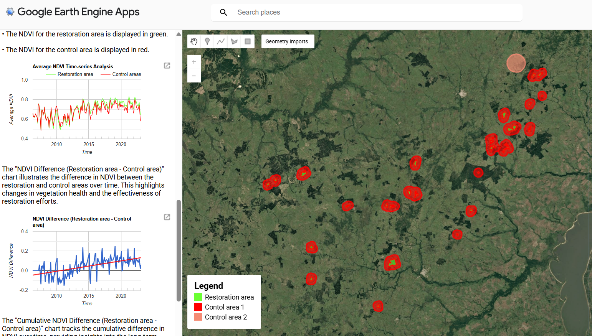

# Restoration-Monitor-EO
This repository contains a Google Earth Engine (GEE) application for monitoring restoration projects using satellite data and a Difference-in-Differences (DiD) approach.
The tool enables users to assess environmental changes in restoration areas by comparing them with control areas over time using MODIS-derived indicators:
- Normalized Difference Vegetation Index (NDVI)
- Land Surface Temperature (LST)
- Normalized Difference Water Index (NDWI)
The workflow integrates spatial filtering, time-series analysis, and statistical comparison to estimate project impact.

### Getting Started
To use this tool, you do not need to install any local dependencies. The application runs entirely in Google Earth Engine.
### Step 1: Access Google Earth Engine
Ensure you have an active Earth Engine account:
https://earthengine.google.com/
Then open the Code Editor:
https://code.earthengine.google.com/

### Step 2: Load the script
1. Copy the script from this repository
2. Paste it into the Earth Engine Code Editor
3. Click **Run**

### Data Requirements
The application depends on Earth Engine FeatureCollections stored as assets.
projects/ee-ocsgeospatial/assets/CarbonOffsetData/
```
├── africa_v4
├── asia_v4
├── north_america_v5_
├── south_americav4
├── oceaniav4
└── europev4
```
Each dataset must contain:

### Required attributes
| Field | Description |
|------|------------|
| `ProjectID` | Unique project identifier |
| `Country` | Country name |
| `Project_Na` / `Project Na` | Project name |
| `Project_St` / `Project St` | Start date (MM/dd/yyyy) |
| `Project_En` / `Project En` | End date (MM/dd/yyyy) |

### Geometry
- Polygon representing the restoration boundary  
- Must be valid (no self-intersections)
  
## Data Source
For demonstration purposes, this application uses a database of 503 restoration project sites derived from:
Karnik et al. (2024), *An open-access database of nature-based carbon offset project boundaries*.  
[https://zenodo.org/records/11459391]
The dataset was integrated into Earth Engine as FeatureCollections and used to populate the restoration project locations in this tool.
Users can replace these datasets with their own project data, provided it follows the required schema described above.


### Running the Application
After running the script:
1. Select a **Country**
2. Select a **Restoration Area**
3. Select an **Indicator**

### The tool will:
- Display restoration and control areas on the map  
- Generate time-series charts  
- Compute Difference-in-Differences (DiD) estimates  

## Workflow
**User input** (Country → Project → Indicator)  
↓  
**Load project geometry**  
↓  
**Generate control areas**  
*(buffer + random polygon)*  
↓  
**Time-series comparison**  
*(treatment vs control)*  
↓  
**Difference-in-Differences (DiD)**  
↓  
**Visual outputs** (map + charts)
## Application Interface



*Example view showing restoration areas, control areas, and time-series charts.*

### Author
Author: Vivian Ondieki  
Affiliation: FAO – EOSTAT
